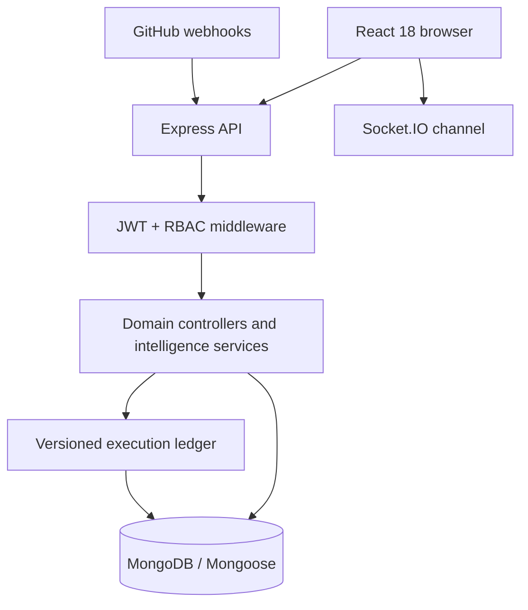

# TaskFlow release architecture

TaskFlow’s product thesis is: **“See what ships, what slips, and why.”**

The application is an engineering delivery intelligence platform. It combines task execution, dependency graphs, release forecasting, architectural decisions, team capacity, GitHub evidence, and an application-level activity ledger while preserving object-level privacy.

## Runtime topology



The production code lives in `frontend/` and `backend/`. The legacy `client/` and `server/` trees are retained for compatibility and are not part of the active runtime.

## Capability map

| Area | Primary surfaces | Contract |
| --- | --- | --- |
| Command center | `/dashboard` | Personal flow health and attention queue |
| Execution | `/tasks`, `/execution-graph` | RBAC-scoped tasks, DAG analysis, blocker propagation |
| Delivery planning | `/projects`, `/releases` | Project archival, milestones, readiness, forecast path |
| Decisions | `/decisions` | ADR lifecycle, supersession, delivery impact |
| Capacity | `/team-capacity` | Commitment pressure, WIP, ownership risk; no productivity scoring |
| History | `/activity` | Cursor-paginated versioned execution events |
| Evidence | `PUT /api/tasks/:id/github`, `POST /api/webhooks/github` | PR/commit linkage and CI/merge verification |

## API contract highlights

All protected API routes use `Authorization: Bearer <jwt>` and enforce project/task-level access before returning data.

| Route | Purpose |
| --- | --- |
| `GET /api/projects/:projectId/delivery-intelligence` | Release forecast, critical paths, blockers, and downstream impact |
| `GET /api/projects/:projectId/capacity-intelligence` | Capacity and WIP intelligence (manager/admin project scope; member personal scope) |
| `GET /api/projects/:projectId/activity` | Project-scoped activity timeline |
| `GET /api/activity` | Global cursor-paginated activity feed |
| `GET /api/activity/coverage` | Admin ledger coverage diagnostics |
| `GET /api/decisions/:id/impact` | Decision delivery-impact analysis |
| `PUT /api/tasks/:id/github` | Link a GitHub repository, pull request, and optional commit |
| `POST /api/webhooks/github` | HMAC-verified GitHub pull-request/check-suite webhook |

Canonical forecast statuses are `on_track`, `at_risk`, `slipping`, and `indeterminate`. Member responses intentionally omit project-wide aggregates, colleague details, hidden dates, and inaccessible identifiers.

## Ledger and consistency

Mutations run through the transaction-aware ledger wrapper. Replica-set MongoDB uses `withTransaction()` so aggregate mutation, version advancement, and event insertion commit together. Standalone MongoDB uses a disclosed monotonic-sequence fallback with correlation-id idempotency and coverage diagnostics for detectable gaps.

Execution events are application-level operational history for delivery traceability. They are not a cryptographically tamper-proof or legal audit system.

## Local verification

Run these commands from the repository root:

```bash
cd backend && node test-security-verify.js
cd ../frontend && npm run build
```

The visual QA harness must use an isolated MongoDB database and an isolated JWT secret. Never point screenshot or seed tooling at a shared production database.

## GitHub evidence setup

1. Set `GITHUB_WEBHOOK_SECRET` in the backend environment.
2. Configure a GitHub webhook to `https://<backend-host>/api/webhooks/github` with content type `application/json` and the same secret.
3. Subscribe to `Pull requests` and `Check suites` events.
4. Link a task using `PUT /api/tasks/:id/github`.

The webhook rejects missing or invalid signatures and only mutates tasks whose stored repository and pull-request number match the incoming event.

## Deployment checklist

- Provision MongoDB with a replica set when atomic ledger transactions are required.
- Set `MONGO_URI`, `JWT_SECRET`, `CLIENT_URL`, and `GITHUB_WEBHOOK_SECRET` in the backend environment.
- Build the frontend with `npm run build` and serve the generated `frontend/build` directory.
- Configure CORS to the deployed frontend origin and expose the webhook endpoint over HTTPS.
- Run the backend regression suite and frontend production build before each release.
- Do not commit `.env` files, database dumps, build output, node modules, or QA screenshots.
